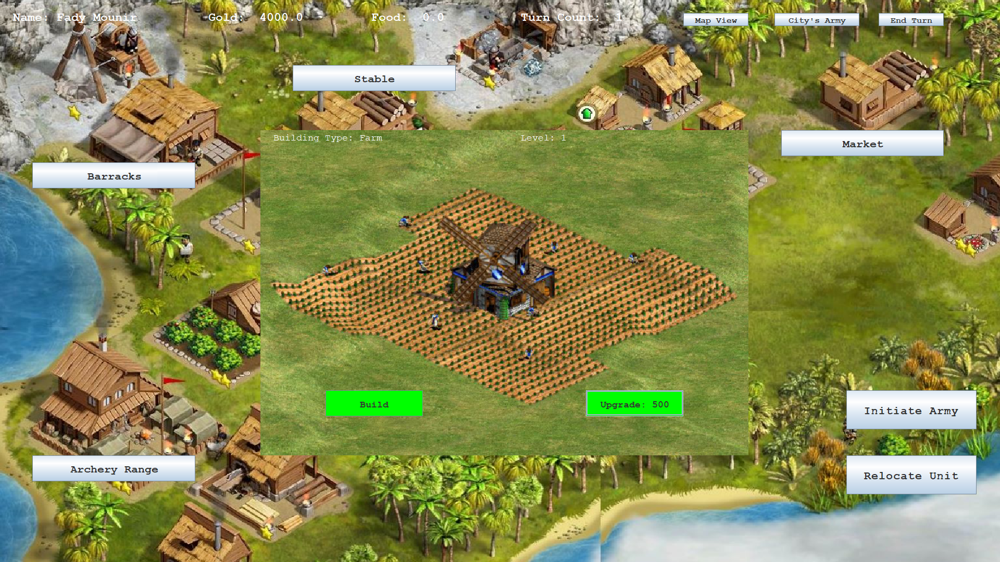
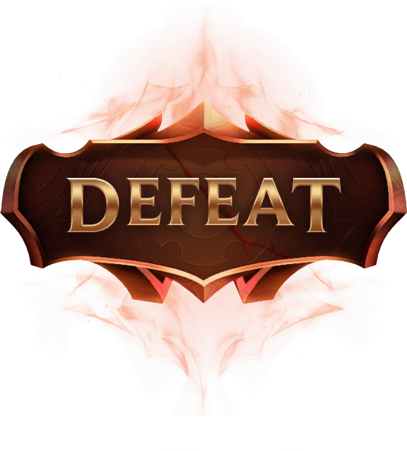

# The-Carnage:         Java OOP & GUI Empire Building Game

## Welcome to The-Carnage, 

An engaging Java-based empire building game that combines the power of object-oriented programming (OOP) with a user-friendly graphical user interface (GUI).

 In this turn-based strategy game, players are challenged to establish and expand their empires amidst intense battles and strategic decision-making.

### Game Overview:
 - Objective: Dominate the world by conquering every city within a limited number of turns.
 - Starting Point: Players select a historical city as the epicenter of their empire's expansion.
 - Empire Expansion: Utilize city management strategies to construct buildings, manage resources, and recruit armies for conquest.
 - Strategic Depth: Balance between economic development, military prowess, and diplomatic relations to achieve global supremacy.

### Key Features:
 - Single Player Mode: Engage in thrilling gameplay against AI opponents with varying difficulties.
 - City Management: Plan and develop cities by constructing diverse buildings with unique benefits and functionalities.
 - Military Conquest: Train and command armies to conquer enemy territories and expand your influence across the map.
 - Diplomatic Options: Negotiate alliances or wage war with rival empires to shape the geopolitical landscape.

Explore the dynamic gameplay and captivating visuals of The-Carnage through the following screenshots:

 - City Management Interface
 - Military Command Center
 - World Map with Controlled Territories
How to Play:
 - Commence Your Empire: Choose a historical city as the foundation of your empire and commence your conquest.
 - Strategic Development: Manage resources, construct buildings, and expand your cities to enhance your empire's capabilities.
 - Forge Alliances or Wage War: Navigate diplomatic challenges by forming alliances or engaging in strategic warfare with rival empires.
 - Achieve Global Domination: Execute tactical maneuvers, dominate battles, and conquer enemy territories to achieve global dominance.
 - The-Carnage offers an immersive gaming experience, blending Java's OOP principles with a visually appealing GUI, and challenging gameplay mechanics. Are you prepared to lead your empire to victory and etch your name in history?

## Game Screenshots:

### Start_Game: 

### World_Map:

### All_assets_that_you_can_Build:

### You_can_upgrade_each_asset:

### Can_recruit_and_upgrade_if_u_have_coins:

### City_Armies:

### Battle_Scene:

### Defeat:

## For WIN SCREEN YOU WILL HAVE TO PLAY THE GAME TO SEE IT FOR YOURSELF ! 😎😉

^^Fady Mounir^^ 
